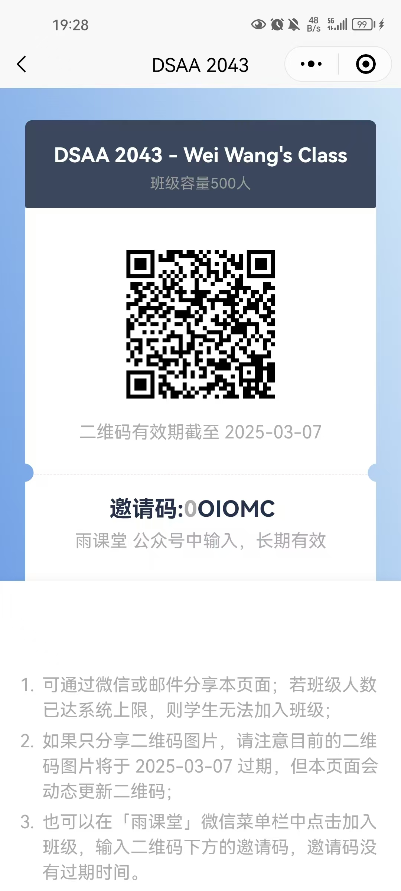

<link rel="stylesheet" href="pandoc.css">

# DSAA2043 L01 (2025 Spring)

## Announcements

* *25 Mar*: 
    * You can go to **E1-227** to test out the midterm exam environment (`Ubuntu`, `Jupyter Notebook`, and optionally `vscode`). Our TA will be there to offer help if any. 
    * You can check out [**the practice questions here**](./practice_v3-online.html).
* *24 Mar*: The mid-term exam will be held in **E1-227**, **10:30--12:00**, **27 Mar (Thu)**.
    * **Arrival**: Please arrive at least 10 minutes before the exam and queue up outside the room until we admit you.
    * **Things to bring**: Student ID and Pen **only** (we will supply the scratch paper)
    * **Format**: 1 short answer question + 4 coding questions
    * **Contents**: L01 to L05
* *13 Mar*: Added the additional slides (following [CLRS]) for quicksort (The analysis of expected runtime is not required.)
* *5 Feb*: We will have our first lecture tomorrow at 10:30-11:50 at W1-222. We will be using 雨课堂 for teaching and QQ for class discussion. Please join the respective groups by scanning using wechat and QQ, respectively: {width=50, loading=lazy} + {width=50, loading=lazy}
* *20 Jan*: Webpage online. 

## Labs

<!--
## Tutorial
-->

## About the Course

|Role|Name|Office|Email               |
|---------|-----|-----------|-----------------------|
| Lecturer | [Prof. Wei Wang](http://wei-wang.net) | W4 515 | `weiwcs` at `ust.hk` 
| TA | Liuchang Jing | | `ljing248` at `connect.hkust-gz.edu.cn`

|Form|Day|Time|Venue               |
|---------|-----|-----------|-----------------------|
| Lectures | Tue + Thu | 1030 - 1150 | W1-222 
| Lab | Fri | 1030 - 1120 | E1-228 
| Consultation | Fri | 1230 - 1330 | W4-515 

### Textbooks and References

|Type|Acronym|Title|Authors               |
|-------------|-----|-----------|--------------|
| Textbook | **CLRS** | Introduction to Algorithms | Cormen, Leiserson, Rivest, and Stein 
| Reference Book | | Algorithm Design  |  Kleinberg and Tardos
| Reference Book | | The Algorithm Design Manual  | Steven Skiena

<!--See the [manual here](./lect/DCAI.pdf)
## AI Assistant Learning System

Coming soon.
-->

## Syllabus 

<!--
////
*Note* that slides cannot cover all the technical contents in details. Reading the textbook is a must.
////

[cols="2,4,2,2,2"]
|===
| *Week*      | *Contents*      | *Reading*                             | *Tutorial/Assignment/Project*    | Video  Recording

| 1 (7 Feb)  | link:./lect/L0.pdf[Course Intro]  | | | Recording
|===
-->

<!-- c.f., https://github.com/squidfunk/mkdocs-material/discussions/6658 -->

<table markdown>
<thead markdown>
<tr markdown>
<th>Date</th>
<th>Contents</th>
<th>Resource</th>
<th>Assessment</th>
</tr>
</thead>
<tbody markdown>

<tr markdown>
<td markdown>Feb 6</td>
<td markdown>[Logistics + Introduction](./lect/L01-Intro-weiw.pdf)</td>
<td markdown></td>
<td markdown>Lab 1</td>  
</tr>

<tr markdown>
<td markdown>Feb 11</td>
<td markdown>[Logistics + Introduction](./lect/L01-Intro-weiw.pdf)</td>
<td markdown></td>
<td markdown>Lab 1</td>  
</tr>

<tr markdown>
<td markdown>Feb 13</td>
<td markdown>[Logistics + Introduction](./lect/L01-Intro-weiw.pdf)</td>
<td markdown></td>
<td markdown>Lab 1</td>  
</tr>

<tr markdown>
<td markdown>Feb 18</td>
<td markdown>[Introduction](./lect/L01-Intro-weiw.pdf)</td>
<td markdown></td>
<td markdown>Lab 2</td>  
</tr>

<tr markdown>
<td markdown>Feb 20</td>
<td markdown>[Introduction](./lect/L01-Intro-weiw.pdf)</td>
<td markdown></td>
<td markdown>Lab 3</td>  
</tr>

<tr markdown>
<td markdown>Feb 25</td>
<td markdown>[Asymptotic](./lect/L02-Asymptotic.pdf)</td>
<td markdown></td>
<td markdown>Lab 3</td>  
</tr>

<tr markdown>
<td markdown>Feb 27</td>
<td markdown>[Asymptotic](./lect/L02-Asymptotic.pdf)</td>
<td markdown></td>
<td markdown>Lab 3</td>  
</tr>

<tr markdown>
<td markdown>Mar 4</td>
<td markdown>[Sorting](./lect/L03-Sorting.pdf)</td>
<td markdown></td>
<td markdown>Lab 4</td>  
</tr>

<tr markdown>
<td markdown>Mar 6</td>
<td markdown>[Sorting](./lect/L03-Sorting.pdf)</td>
<td markdown></td>
<td markdown>Lab 4</td>  
</tr>

<tr markdown>
<td markdown>Mar 11</td>
<td markdown>[*Additional* slides on Quicksort](./lect/L03-QuickSort.pdf)</td>
<td markdown></td>
<td markdown>Lab 5</td>  
</tr>

<tr markdown>
<td markdown>Mar 13</td>
<td markdown>[Advanced Data Structure](./lect/L04-AdvDataStructures.pdf)</td>
<td markdown></td>
<td markdown>Lab 5</td>  
</tr>

<tr markdown>
<td markdown>Mar 18</td>
<td markdown>[Advanced Data Structure](./lect/L04-AdvDataStructures.pdf) + [Divide & Conquer](./lect/L05-D&C.pdf)</td>
<td markdown></td>
<td markdown>Lab 6</td>  
</tr>

<tr markdown>
<td markdown>Mar 25</td>
<td markdown>[Divide & Conquer](./lect/L05-D&C.pdf)</td>
<td markdown></td>
<td markdown>Lab 6</td>  
</tr>

<tr markdown>
<td markdown>Apr 1</td>
<td markdown>[Divide & Conquer](./lect/L05-D&C.pdf) + [Karatsuba algorithm](./lect/L5-extra.pdf) + [Dynamic Programming (1)](./lect/L06-DP.pdf) + [Extra](./lect/L6-extra.pdf)</td>
<td markdown></td>
<td markdown>Lab 7</td>  
</tr>

<tr markdown>
<td markdown>Apr 8</td>
<td markdown>[Dynamic Programming (2)](./lect/L07-DP.pdf) + [DP Extra](./lect/DP-extra.pdf)</td>
<td markdown></td>
<td markdown>Lab 8</td>  
</tr>

<tr markdown>
<td markdown>Apr 10</td>
<td markdown>[Greedy](./lect/L08-Greedy.pdf)</td>
<td markdown></td>
<td markdown>Lab 8</td>  
</tr>

<tr markdown>
<td markdown>Apr 15</td>
<td markdown>[Greedy](./lect/L08-Greedy.pdf)</td>
<td markdown></td>
<td markdown>Lab 9</td>  
</tr>

<tr markdown>
<td markdown>Apr 17</td>
<td markdown>[Graph I](./lect/L09-Graph.pdf)</td>
<td markdown></td>
<td markdown>Lab 9</td>  
</tr>

<tr markdown>
<td markdown>Apr 22</td>
<td markdown>[Graph I](./lect/L09-Graph.pdf)</td>
<td markdown></td>
<td markdown>Lab 10</td>  
</tr>

<tr markdown>
<td markdown>Apr 24</td>
<td markdown>[Graph II](./lect/L10-GraphII.pdf)</td>
<td markdown></td>
<td markdown>Lab 10</td>  
</tr>

<tr markdown>
<td markdown>Apr 29</td>
<td markdown>[Graph II](./lect/L10-GraphII.pdf) + [P-NP](./lect/L11-P-NP.pdf)</td>
<td markdown></td>
<td markdown>Lab 11</td>  
</tr>

<tr markdown>
<td markdown>May 6</td>
<td markdown>[P-NP](./lect/L11-P-NP.pdf)</td>
<td markdown></td>
<td markdown>Lab 12</td>  
</tr>

<tr markdown>
<td markdown>May 8</td>
<td markdown>[NPC](./lect/L11-NPC.pdf)</td>
<td markdown></td>
<td markdown>Lab 12</td>  
</tr>

</tbody>
</table>