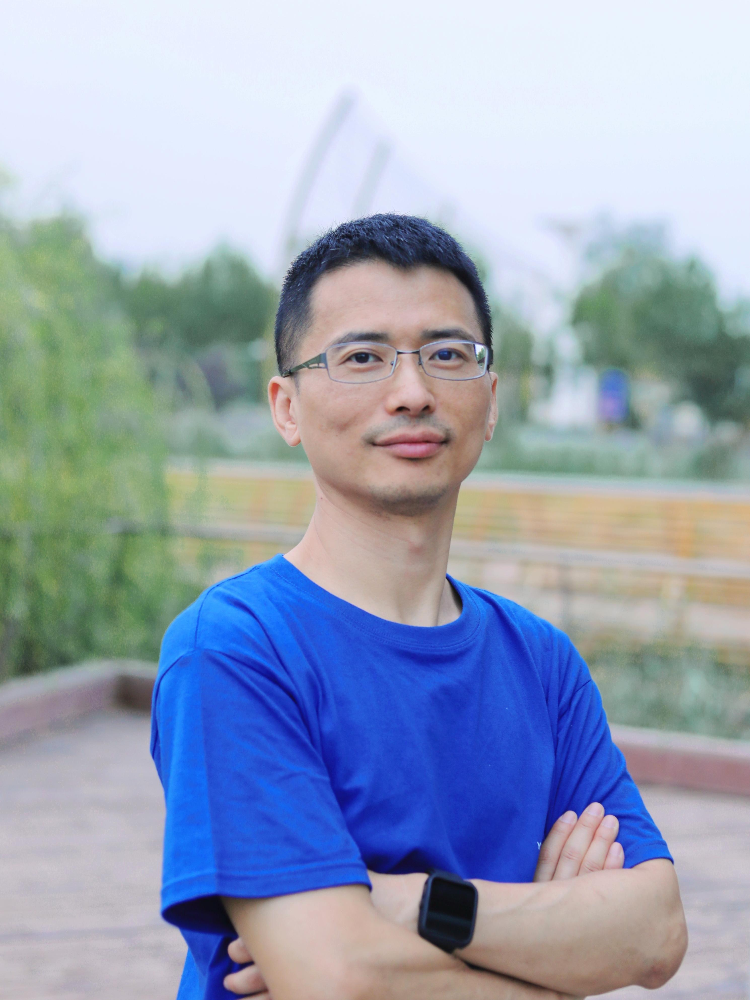

# Introduction

/// html | div.hero-art-container
<canvas id="hero-art" class="hero-art-canvas" data-art-type="network" data-animated="true"></canvas>

  

    <h2>Exploring the Intersection of Data, AI, and Science</h2>
    
Research-driven innovation in databases, machine learning, and cross-disciplinary applications

  

///

/// html | div[style='float: left; width: 30%;']
{width=300, loading=lazy}
///

/// html | div[style='float: right;width: 65%;']
I am currently a tenured **Professor** in the [Data Science and Anaytics （数据科学与分析学域）](https://infh.hkust-gz.edu.cn/en/academics/dsa), and the **Associate Dean** of [Information Hub （信息枢纽）](https://hkust-gz.edu.cn/academics/four-hubs/information-hub), [The Hong Kong University of Science and Technology (Guangzhou)](http://hkust-gz.edu.cn), and I am also an affiliated Professor at [HKUST](http://www.ust.hk). Previously, I was a Redbird Visiting Professor in the [Department of Computer Science and Engineering](http://www.cse.ust.hk), [HKUST](http://www.ust.hk), and a **Professor** in the School of Computer Science and Engineering, University of New South Wales, Australia. 

/// admonition | Contact
- Email:  `weiwcs AT ust.hk`
- Office: W4 515 ([Campus Map](https://amat.hkust-gz.edu.cn/wp-content/uploads/2024/03/map@2x.jpg), [Campus Navigator](https://itd.hkust-gz.edu.cn/en/detail-361))
- Google Scholar: [https://scholar.google.com/citations?user=wLtu3FYAAAAJ&hl=en](https://scholar.google.com/citations?user=wLtu3FYAAAAJ&hl=en)
- Github: [https://github.com/DBAIWangGroup](https://github.com/DBAIWangGroup)
///

///

/// html | div[style='clear: both;']
///

# Research

My research areas include **Databases**, **Algorithms**, **Artificial Intelligence** and **Cross-disciplinary Topics**. I have published research papers in these areas, with a majority of them in prestigious international journal and conferences. 

I have won several awards, including **SIGSPATIAL Best Vision Paper**, **ICASSP 2023 Top 3% Paper**, **SIGCOMM 2022 Best Paper**, **ICMR 2021 Best Paper** and **DASFAA 2016 Best Student Paper** awards. In addition, several pieces of my research have been deployed in industrial projects and products. 

My current research interests are: 

* <mark>Integration of database and artificial intelligence technologies</mark>, including learned indexes, learned algorithms and optimizations, and intelligent data preprocess and postprocessing (e.g., data cleansing/integration and NLP interface for DB/applications). 
* <mark>Machine Learning and Deep Learning</mark>, including <mark>Large Language Models</mark>, <mark>Theoretical Aspects of Machine/deep Learning</mark>, and <mark>Agentic AI</mark>.
* <mark>Understanding high-dimensional data</mark>, including its structure, properties, and algorithms (e.g., vector databases). 
* <mark>Cross-disciplinary research and applications</mark>, including <mark>Material Informatics</mark> (e.g., material property prediction, material design, physics-informed neural networks, sybmolic regression, etc.), <mark>AI for Science</mark> (e.g., neural operator learning for solving PDEs), and <mark>AI for Education</mark>. 

Also see 

* [my Google Scholar page](https://scholar.google.com/citations?hl=en&user=wLtu3FYAAAAJ&pagesize=100&view_op=list_works) for a fairly up-to-date, manually curated list of publications --- my name is a challenge for Named Entity Disambiguation (e.g., ["The base name with the most different numeric suffixes (i.e., identified authors) is Wei Wang"](https://blog.dblp.org/2020/03/18/name-disambiguation-suffixes-in-dblp/) and motivated me to work on [Entity Resolution](./resources/tutorials/ER21-tutorial-entity-resolution.md)
* [my GitHub page](https://github.com/DBAIWangGroup) for a list of code repositories for my teaching and research. 

# Teaching

- I am the **Computer Science Coordinator** of HKUST(GZ), in charge of all Computer Science-related courses in the first two years for our UG students. 
- I am overseeing UG teaching related issues in the Information Hub, HKUST(GZ). 
- Currently, we are building AI4Edu systems based on Large Language Models, with the aim to explore new learning paradigms. 

# Service

I am an Associate Editor of IEEE TKDE, Journal of Material Informatics, and Data Science and Engineering. I also served as PC Co-chairs of [IEEE BigData 2023](http://bigdataieee.org/BigData2023/) and APWeb 2012, PC Vice-chairs of ICDE 2014 and 2018. I also served in other organizational roles in many conferences and workshops, as well as reviewers and PC members for major journals and conferences.  

I am the Vice Directors of Guangzhou Municipal Key Laboratory of Materials Informatics, Guangzhou Municipal Key Laboratory of Electronic Design Automation, Guangzhou Municipal Key Laboratory of Big Data and Intelligence. 

# Prospective Student

I am always looking for curious and motivated PhD/MPhil/RA/Visiting student to join our lab at HKUST(GZ). Please read [**this post** for the current vacancy (**2025**)](./research/vacancy.md). 