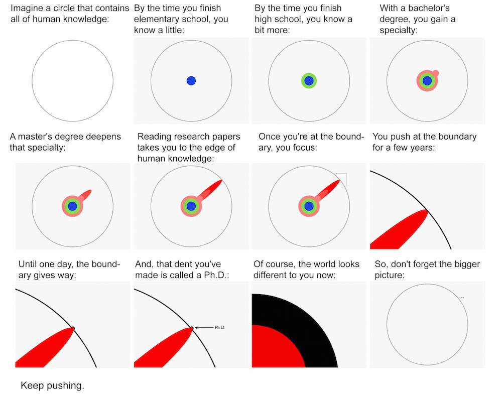
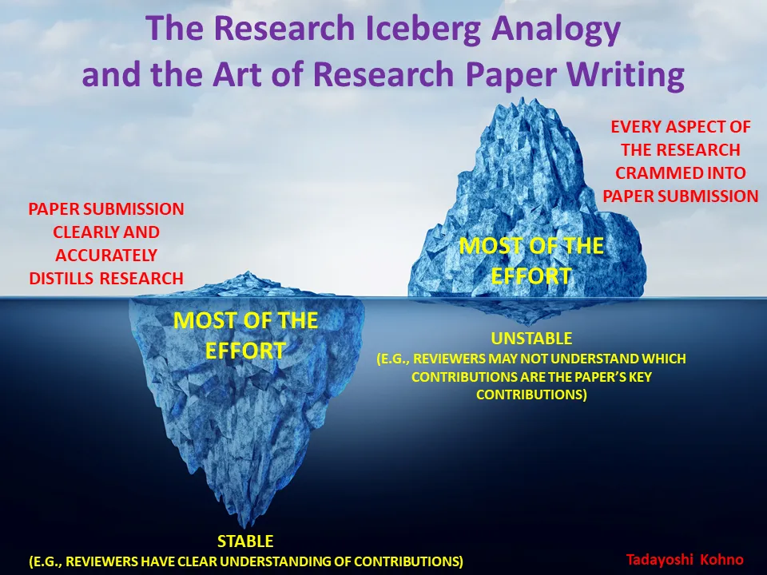

---
tags:
  - research
  - github
  - info
  - resource
  - teaching
---

# Research 

## Points to Ponder

- [Cargo Cult Science](https://calteches.library.caltech.edu/51/2/CargoCult.htm), by RICHARD P. FEYNMAN. 

- {width=300, align=left}
  [The illustrated guide to a Ph.D.](https://matt.might.net/articles/phd-school-in-pictures/), by Matthew Might.    

- {width=300, align=left}
  [The Art of Research Paper Writing and the Research Iceberg Analogy](https://medium.com/navigating-academia/the-art-of-research-paper-writing-and-the-research-iceberg-analogy-bf8e4fcabb5), by Tadayoshi Kohno.

- In the era of human-level AI, what is the relevant and novel research then? 

## Mottos

- “Study hard what interests you the most in the most undisciplined, irreverent and original manner possible.” – Richard Feynmann

- _regarding_the_discovery_of_Quaternions_multiplication_by_Sir_William_Rowan_Hamilton.jpg){width=300, align=left}
"Every morning in the early part of October 1843, on my coming down to breakfast, your brother William Edwin and yourself used to ask me: "Well, Papa, can you multiply triples?" Whereto I was always obliged to reply, with a sad shake of the head, "No, I can only add and subtract them." – History of quaternions (Wikipedia)

- “Failure is a good option, if you are not failing you're not trying hard enough.” ― Elon Musk

- “Any fool can make something complicated. It takes a genius to make it simple.” ― Woody Guthrie 

- “The path isn't a straight line; it’s a spiral. You continually come back to things you thought you understood and see deeper truths.”
― Barry H. Gillespie

- “苟日新，日日新，又日新” ― 《礼记·大学》

- “庖丁解牛；惟手熟尔” ― 《庄子・养生主》；《卖油翁》

- “To live is the rarest thing in the world. Most people exist, that is all.” ― Oscar Wilde