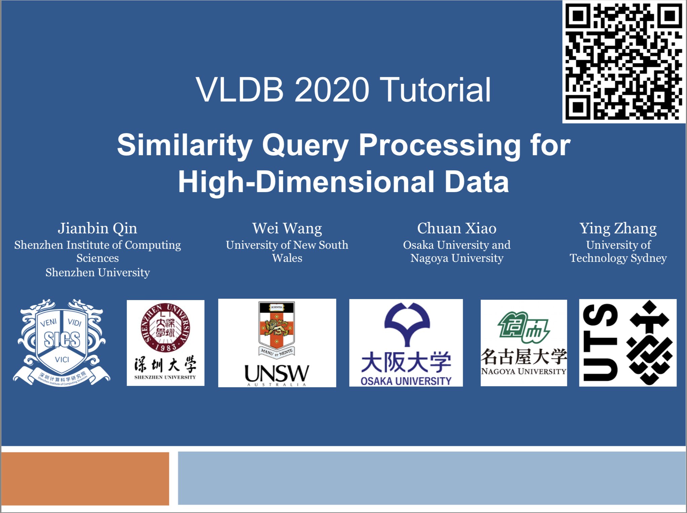

This is the resource page for our VLDB 2020 tutorial titled "Similarity Query Processing for High-Dimensional Data" by Jianbin Qin, Wei Wang, Chuan Xiao, and Ying Zhang. 

## Paper

Jianbin Qin, Wei Wang, Chuan Xiao, Ying Zhang: Similarity Query Processing for High-Dimensional Data. Proc. VLDB Endow. 13(12): 3437-3440 (2020) 
[pdf](http://www.vldb.org/pvldb/vol13/p3437-qin.pdf)

### Abstract

Similarity query processing has been an active research topic for several decades. It is an essential procedure in a wide range of applications. Recently, embedding and auto-encoding methods as well as pre-trained models have gained popularity. They basically deal with high-dimensional data, and this trend brings new opportunities and challenges to similarity query processing for high-dimensional data. Meanwhile, new techniques
have emerged to tackle this long-standing problem theoretically and empirically. 

In this tutorial, we summarize existing solutions, especially recent advancements from both database (**DB**) and machine learning (**ML**) communities, and analyze their strengths and weaknesses. We review exact and approximate methods such as cover tree, locality sensitive hashing, product quantization, and proximity graphs. We also discuss the selectivity estimation problem and show how researchers are bringing in state-of-the-art ML techniques to address the problem. By highlighting the strong connections between DB and ML, we hope that this tutorial provides an impetus towards new ML for DB solutions and vice versa.

## Slides

Slides (updated on 4 Sept 2020):

1. [Introduction](./files/VLDB20-tutorial-1-intro-wang.pdf)
2. [Exact Query Processing](./files/VLDB20-tutorial-2-exact-qin.pdf)
3. [Approximate-1](./files/VLDB20-tutorial-3a-ANN-wang.pdf)
4. [Approximate-2](./files/VLDB20-tutorial-3b-ANN-wang.pdf)
5. [Approximate-3](./files/VLDB20-tutorial-4-ANN-zhang.pdf)
6. [Estimation](./files/VLDB20-tutorial-5-estimation-xiao.pdf)
7. [Open Problems](./files/VLDB20-tutorial-6-epilogue-wang.pdf)

